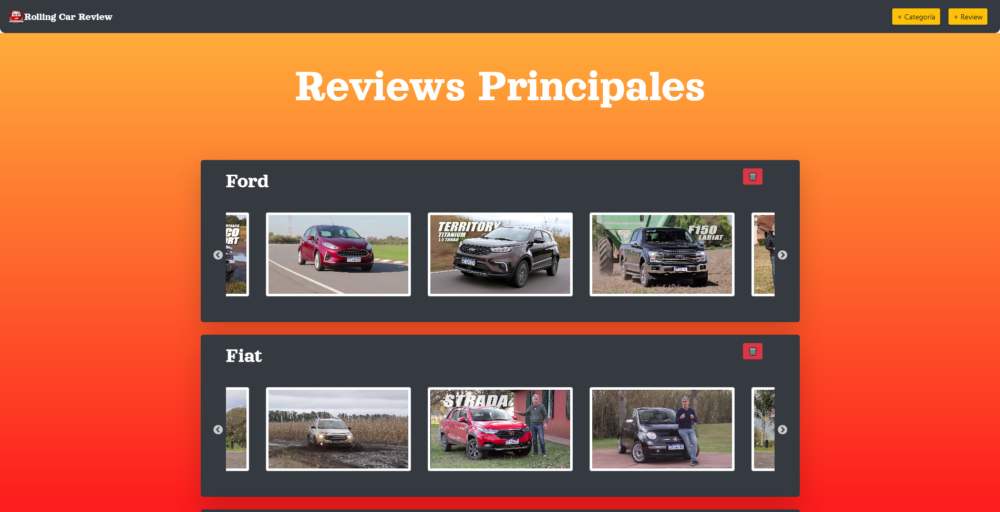

# Rolling Car Review - Frontend

## Quevedo, Franco

Este es el repositorio backend de una aplicación básica para administrar reviews de autos realizada utilizando el Stack MERN (MongoDB, Express, React, Node js)

Esta aplicación puede realizar operaciones CRUD* (Create/Read/Update/Delete) de:
- Reviews de Autos de YouTube
- Categorías de Autos
- Comentarios en las reviews

*Update estará disponible a partir de la siguiente versión

## Screenshot

